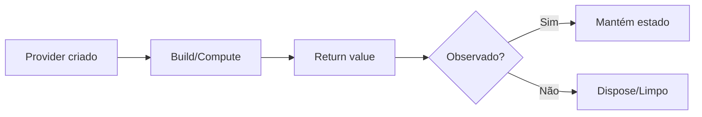

# Delivery App Frontend - Arquitetura Flutter

## 📋 Visão Geral

Aplicativo mobile de delivery desenvolvido com **Flutter** e **Dart**, utilizando uma arquitetura profissional, modular e escalável.

## 🏗️ Arquitetura

### **Clean Architecture Leve + Feature-First Organization**

A aplicação segue princípios de Clean Architecture adaptados para mobile, com organização baseada em features:

```
lib/
├── config/                          # Configuração global
│   └── app_routes.dart              # Roteamento (GoRouter)
│
├── core/                            # Núcleo compartilhado
│   ├── constants/
│   │   ├── api_constants.dart       # URLs e endpoints da API
│   │   └── app_constants.dart       # Constantes do app
│   ├── theme/
│   │   └── app_theme.dart           # Tema visual centralizado
│   └── extensions/                  # Extensões do Dart
│
├── shared/                          # Código compartilhado entre features
│   ├── models/                      # Modelos de dados
│   │   ├── restaurant.dart
│   │   ├── product.dart
│   │   ├── order.dart
│   │   └── order_item.dart
│   ├── services/                    # Serviços HTTP
│   │   ├── restaurant_service.dart
│   │   ├── product_service.dart
│   │   └── order_service.dart
│   ├── providers/                   # Providers Riverpod compartilhados
│   │   ├── dio_provider.dart        # Provider do cliente HTTP
│   │   └── service_providers.dart   # Providers dos serviços
│   └── widgets/                     # Widgets reutilizáveis
│       ├── loading_widget.dart
│       ├── error_widget.dart
│       └── cards_widget.dart
│
├── features/                        # Features (funcionalidades)
│   ├── home/                        # Feature: Listagem de restaurantes
│   │   └── presentation/
│   │       ├── pages/
│   │       │   └── home_page.dart
│   │       └── providers/
│   │           └── restaurant_providers.dart
│   │
│   ├── restaurant_detail/           # Feature: Detalhes do restaurante
│   │   └── presentation/
│   │       ├── pages/
│   │       │   └── restaurant_detail_page.dart
│   │       └── providers/
│   │           └── product_providers.dart
│   │
│   ├── cart/                        # Feature: Carrinho de compras
│   │   └── presentation/
│   │       ├── pages/
│   │       │   └── cart_page.dart
│   │       └── providers/
│   │           └── cart_providers.dart
│   │
│   ├── orders/                      # Feature: Criação de pedido
│   │   └── presentation/
│   │       ├── pages/
│   │       │   └── checkout_page.dart
│   │       └── providers/
│   │           └── order_providers.dart
│   │
│   └── order_tracking/              # Feature: Acompanhamento de pedido
│       └── presentation/
│           ├── pages/
│           │   └── order_tracking_page.dart
│           └── providers/
│               └── order_tracking_providers.dart
│
└── main.dart                        # Ponto de entrada do app
```

## 🔑 Decisões Arquiteturais

### 1. **Riverpod vs Provider**

Escolhemos **Riverpod** por:
- ✅ **Type-safe**: Melhor suporte do compilador Dart
- ✅ **Sem BuildContext**: Mais flexível e testável
- ✅ **AsyncValue nativo**: Melhor para dados assíncronos
- ✅ **Scoping granular**: Melhor cache e invalidação
- ✅ **Testing simplificado**: Sem necessidade de widget testing

### 2. **Client HTTP: Dio**

- ✅ Interceptadores built-in
- ✅ Retry automático
- ✅ Cancellação de requisições
- ✅ Upload/download com progresso
- ✅ Timeout configurável

### 3. **Roteamento: GoRouter**

- ✅ Navegação type-safe
- ✅ Deep linking automático
- ✅ Tratamento de rotas aninhadas
- ✅ Suporte a path parameters
- ✅ Ativa middleware e guards

### 4. **Organização Feature-First**

Benefícios:
- ✅ **Modularização**: Cada feature é independente
- ✅ **Escalabilidade**: Fácil adicionar novas features
- ✅ **Manutenibilidade**: Mudanças isoladas por feature
- ✅ **Testabilidade**: Componentes testáveis isoladamente
- ✅ **Time scaling**: Múltiplos times podem trabalhar em paralelo

### 5. **Separação de Responsabilidades**

```
Presentation Layer (UI)
    ↓ (Riverpod Providers & StateNotifiers)
Business Logic Layer (Estado)
    ↓ (Services)
Data Layer (HTTP)
    ↓ (Dio)
Backend API
```

## 📱 Fluxo da Aplicação

### 1. **Home Screen**
- Lista restaurantes via API
- Pull-to-refresh para recarregar
- Navegação para detalhes

### 2. **Restaurant Detail**
- Lista produtos do restaurante
- Adiciona itens ao carrinho
- Badge mostra quantidade no carrinho

### 3. **Cart**
- Visualiza itens adicionados
- Incrementa/decrementa quantidade
- Calcula total automaticamente
- Navega para checkout

### 4. **Checkout**
- Resumo completo do pedido
- Confirmação final com validação
- Cria pedido via API
- Navega para acompanhamento

### 5. **Order Tracking**
- Timeline visual do status
- Informações do restaurante
- Itens e total do pedido
- Pull-to-refresh para atualizar

## 🛠️ Tecnologias Utilizadas

| Tecnologia | Versão | Propósito |
|-----------|--------|----------|
| Flutter | 3.x | Framework mobile |
| Dart | 3.x | Linguagem |
| Riverpod | 2.6.0 | State management |
| Dio | 5.4.0 | HTTP client |
| GoRouter | 14.2.0 | Roteamento |
| json_serializable | 6.8.0 | Serialização JSON |
| Freezed | 2.5.2 | Immutable classes |

## 🚀 Getting Started

### Instalação

```bash
# 1. Instalar dependências
flutter pub get

# 2. Gerar código (json_serializable)
flutter pub run build_runner build

# 3. Executar app
flutter run
```

### Configuração da API

Editar `lib/core/constants/api_constants.dart`:

```dart
static const String baseUrl = 'http://seu-backend.com';
```

## 📊 Padrões de Desenvolvimento

### Provider Pattern

```dart
// Definir um provider para buscar dados
final restaurantsProvider = FutureProvider<List<Restaurant>>((ref) async {
  final service = ref.watch(restaurantServiceProvider);
  return service.getRestaurants();
});

// Usar em um widget
class MyWidget extends ConsumerWidget {
  @override
  Widget build(BuildContext context, WidgetRef ref) {
    return ref.watch(restaurantsProvider).when(
      data: (restaurants) => ...,
      loading: () => ...,
      error: (err, st) => ...,
    );
  }
}
```

### StateNotifier Pattern (Para mutações de estado)

```dart
class CartNotifier extends StateNotifier<List<OrderItem>> {
  CartNotifier() : super([]);

  void addToCart(Product product) {
    state = [...state, OrderItem(...)];
  }
}

final cartProvider = StateNotifierProvider((ref) => CartNotifier());
```

### Error Handling

```dart
try {
  final data = await dio.get(url);
  return Restaurant.fromJson(data);
} on DioException catch (e) {
  print('Erro: ${e.message}');
  rethrow; // Re-throw para Riverpod capturar
}
```

## 🎨 Design System

- **Cores primárias**: `#FF6B6B` (Vermelho), `#4D96FF` (Azul)
- **Tipografia**: Material 3 com WeightFont customizado
- **Spacing**: Sistema de 8px (4, 8, 16, 24, 32)
- **Border Radius**: Small(8dp), Medium(12dp), Large(16dp)

## 📦 Estrutura de Dados

### Restaurant
```json
{
  "id": 1,
  "nome": "Restaurante X",
  "endereco": "Rua Y, 123"
}
```

### Product
```json
{
  "id": 1,
  "nome": "Hamburger",
  "preco": 25.99,
  "restaurante": { "id": 1 }
}
```

### Order
```json
{
  "id": 1,
  "status": "CRIADO",
  "total": 75.98,
  "restaurante": { "id": 1 },
  "itens": [
    {
      "id": 1,
      "quantidade": 2,
      "produto": { "id": 1 }
    }
  ]
}
```

## 🧪 Testing

Riperpod torna testing simples:

```dart
test('adiciona produto ao carrinho', () {
  final container = ProviderContainer();
  
  container.read(cartProvider.notifier).addToCart(product);
  
  expect(container.read(cartProvider).length, 1);
});
```

## 📝 Convenções de Código

- **PascalCase** para classes e types
- **camelCase** para variáveis e métodos
- **SCREAMING_SNAKE_CASE** para constantes
- Prefer immutability
- Type-safe sempre
- Documentar com comments públicos

## 🔄 Ciclo de Vida dos Providers



## 🐛 Debug

Ativar logging do Dio (development):

```dart
// Já está configurado em dio_provider.dart
// LoggingInterceptor mostra todas as requisições
```

## 📚 Recursos Adicionais

- [Riverpod Docs](https://riverpod.dev)
- [Dio Docs](https://pub.dev/packages/dio)
- [GoRouter Docs](https://pub.dev/packages/go_router)
- [Flutter Docs](https://flutter.dev/docs)

## 🚀 Próximas Melhorias

- [ ] Autenticação com JWT
- [ ] Persistência local com Hive
- [ ] Animações avançadas
- [ ] Notificações push
- [ ] Múltiplos idiomas (i18n)
- [ ] Dark mode
- [ ] Unit tests
- [ ] Integration tests

## 📞 Suporte

Para dúvidas sobre a arquitetura, acessar:
- Documentação Riverpod
- Flutter documentation
- Dart guidelines

---

**Desenvolvido com ❤️ seguindo boas práticas profissionais**

